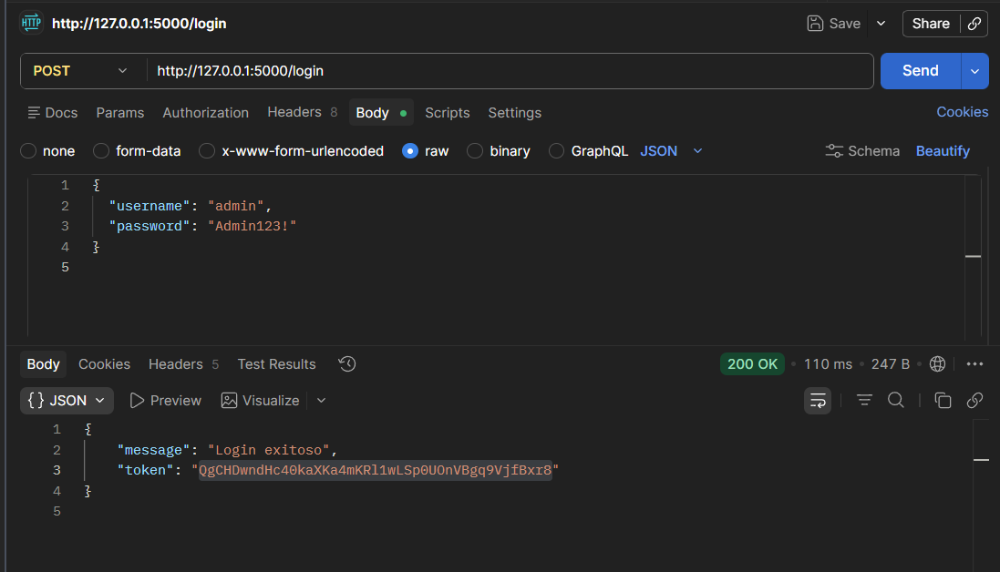
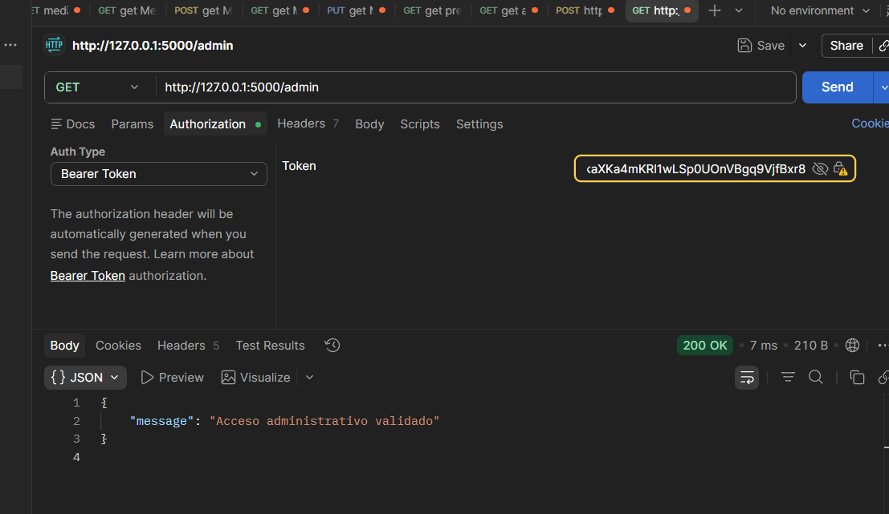

# Security as Code
### TALLER ELABORADO POR: JUAN DIEGO ACOSTA MOLINA
> Solución segura del taller de "Security as Code" con remediación de vulnerabilidades SAST.

## Cómo ejecutar

### 1. Crear y activar el entorno virtual

```bash
python -m venv .venv
.venv\Scripts\Activate.ps1  # En PowerShell
# o
.venv\Scripts\activate      # En CMD/Bash
```

### 2. Instalar dependencias

```bash
pip install -r requirements.txt
```

### 3. Configurar variable de entorno obligatoria

```powershell
$Env:SECRET_KEY = "tu_clave_secreta_aqui"
```

> ⚠️ **Importante**: `SECRET_KEY` es obligatoria. La app no inicia sin ella.

### 4. Ejecutar la aplicación

```bash
python app.py
```

La app estará disponible en `http://127.0.0.1:5000`

---

## Uso de Endpoints

### 1. Login (POST /login)

**Endpoint**: `POST http://127.0.0.1:5000/login`

**Body (JSON)**:
```json
{
  "username": "admin",
  "password": "Admin123!"
}
```

**Respuesta exitosa**:
```json
{
  "message": "Login exitoso",
  "token": "eyJ0eXAiOiJKV1QiLCJhbGc..."
}
```



> Guarda el `token` para las siguientes peticiones.

### 2. Admin (GET /admin) - Requiere autenticación

**Endpoint**: `GET http://127.0.0.1:5000/admin`

**Headers requeridos**:
```
Authorization: Bearer <token_del_login>
```

**Respuesta**:
```json
{
  "message": "Acceso administrativo validado"
}
```



### 3. Search (GET /search) - Seguro contra SQL Injection

**Endpoint**: `GET http://127.0.0.1:5000/search?q=usuario`

**Respuesta**:
```json
{
  "query": "SELECT * FROM users WHERE name = %s",
  "params": ["usuario"]
}
```

### 4. Calc (GET /calc) - Solo operaciones aritméticas seguras

**Endpoint**: `GET http://127.0.0.1:5000/calc?expr=1+2*3`

**Respuesta**:
```json
{
  "result": 7
}
```

### 5. Echo (GET /echo) - Escapado para prevenir XSS

**Endpoint**: `GET http://127.0.0.1:5000/echo?msg=hola`

**Respuesta**:
```json
{
  "message": "hola"
}
```

---

## Medidas de Seguridad Implementadas

### ✅ Errores SAST Remediados

| Error | Remedio |
|-------|---------|
| ✓ Información sensible en código | Secretos movidos a variables de entorno |
| ✓ Valor fijo como mecanismo de seguridad | Tokens generados aleatoriamente con `secrets.token_urlsafe()` |
| ✓ Endpoint crítico sin protección | `/admin` requiere autenticación Bearer token |
| ✓ SQL Injection en /search | Queries parametrizadas, validación de entrada (max 100 chars) |
| ✓ `eval()` sin validación en /calc | Reemplazado con AST parsing seguro, solo operaciones aritméticas permitidas |
| ✓ Debug activo en producción | `DEBUG` controlado por variable de entorno, deshabilitado por defecto |
| ✓ Secreto en código fuente | `SECRET_KEY` se obtiene desde el entorno, no está en app.py |
| ✓ Falta de validación JSON | Validación de tipos en todos los endpoints (`isinstance()` checks) |
| ✓ XSS en /echo | Entrada escapada con `html.escape()` |
| ✓ Exposición de datos internos | Mensajes de error genéricos, sin revelar detalles del sistema |

### 🔐 Técnicas de Seguridad

- **Hashing de contraseñas**: PBKDF2-HMAC-SHA256 con salt
- **Comparación segura**: `secrets.compare_digest()` para evitar timing attacks
- **Tokens de sesión**: Generados con `secrets.token_urlsafe(32)` (aleatoriedad criptográfica)
- **Validación de entrada**: Type checking y límites de tamaño en parámetros
- **Sanitización de salida**: Escapado HTML en respuestas
- **Configuración segura**: Secretos en variables de entorno

---

## Testing con curl

```powershell
# 1. Login
$response = curl -X POST http://127.0.0.1:5000/login -H "Content-Type: application/json" -d '{"username":"admin","password":"Admin123!"}'

# 2. Usar el token (reemplaza <TOKEN>)
curl -H "Authorization: Bearer <TOKEN>" http://127.0.0.1:5000/admin

# 3. Search
curl "http://127.0.0.1:5000/search?q=test"

# 4. Calc
curl "http://127.0.0.1:5000/calc?expr=5*3"
curl "http://127.0.0.1:5000/calc?expr=5+3"

# 5. Echo
curl "http://127.0.0.1:5000/echo?msg=prueba"
```

---

## Notas de Seguridad

- **No subir `.venv` al repositorio**: Usa `.gitignore`
- **No guardar `SECRET_KEY` en Git**: Usa variables de entorno o archivos `.env` ignorados
- **Producción**: Usa un gestor de secretos (AWS Secrets Manager, HashiCorp Vault, etc.)
- **HTTPS**: Activa SSL/TLS en producción

## Errores SAST a buscar en `app.py`

1. Información sensible escrita directamente en el código
2. Valor fijo usado como mecanismo de seguridad
3. Endpoint crítico sin ningún tipo de protección
4. Construcción de consultas sin control de entrada
5. Ejecución de expresiones provenientes del usuario
6. Configuración de depuración activa en entorno no seguro
7. Clave o secreto almacenado directamente en el código fuente
8. Falta de verificación de datos recibidos en una petición
9. Entrada del usuario utilizada sin ningún tipo de filtro
10. Respuesta que expone información interna del sistema